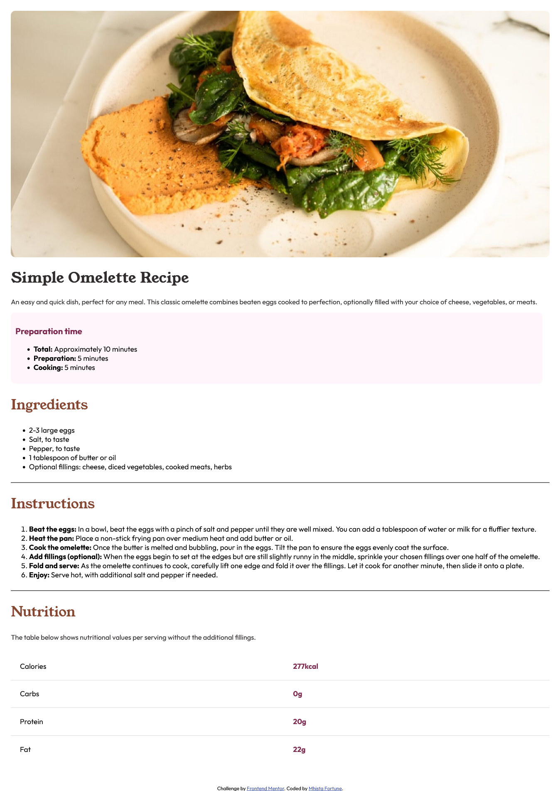
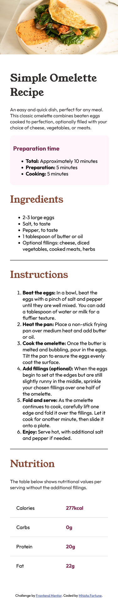

# Frontend Mentor - Recipe page solution

This is a solution to the [Recipe page challenge on Frontend Mentor](https://www.frontendmentor.io/challenges/recipe-page-KiTsR8QQKm). Frontend Mentor challenges help you improve your coding skills by building realistic projects. 

## Table of contents

- [Overview](#overview)
  - [The challenge](#the-challenge)
  - [Screenshot](#screenshot)
  - [Links](#links)
  - [Built with](#built-with)
  - [What I learned](#what-i-learned)
- [Author](#author)
- [Acknowledgments](#acknowledgments)

## Overview

The recipe page is designed to provide users with comprehensive information about a specific meal. This includes the recipe, ingredients, preparation process, and nutritional components, making it easy for users to replicate the meal at home.

### Screenshot

### Links

- Solution URL: [Add solution URL here](https://your-solution-url.com)
- Live Site URL: [Add live site URL here](https://your-live-site-url.com)

### Built with

- Semantic HTML5 markup
- CSS custom properties
- Flexbox
- Mobile-first workflow

### What I learned

When I embarked on the journey of building this QR code component, I discovered a myriad of learning opportunities that enhanced my front-end development skills. Let me walk you through what I learned and how it all came together.

HTML & CSS Fundamentals
First, I delved into the basics of HTML and CSS. Structuring the component with semantic HTML tags and styling it with CSS was a great exercise. I learned how to create a clean layout using flexbox and applied custom fonts and colors to make the design pop.

Responsive Design
Ensuring the component looked good on all screen sizes, especially mobile devices, was crucial. I implemented media queries and used flexible layouts with relative units like percentages and em/rem. This experience taught me the importance of making designs adaptable and user-friendly.

Component Design
Designing this component taught me the value of reusability and encapsulation. I made sure the styles and structure were self-contained, so the component could easily fit into different parts of a web application without any conflicts.

CSS Techniques
I got hands-on experience with the CSS box model, learning to manage padding, margins, and borders to space elements correctly. Positioning elements using different CSS techniques and styling text for better readability were also key skills I developed.

Building this QR code component was more than just a project; it was a comprehensive learning experience that honed my front-end development skills. Each step brought new insights and reinforced my foundation, preparing me for more complex projects in the future.

## Author

- Frontend Mentor - [@Mhista-Fortune](https://www.frontendmentor.io/profile/Mhista-Fortune)
- Twitter - [@fortunate_egwu](https://www.twitter.com/fortunate_egwu)